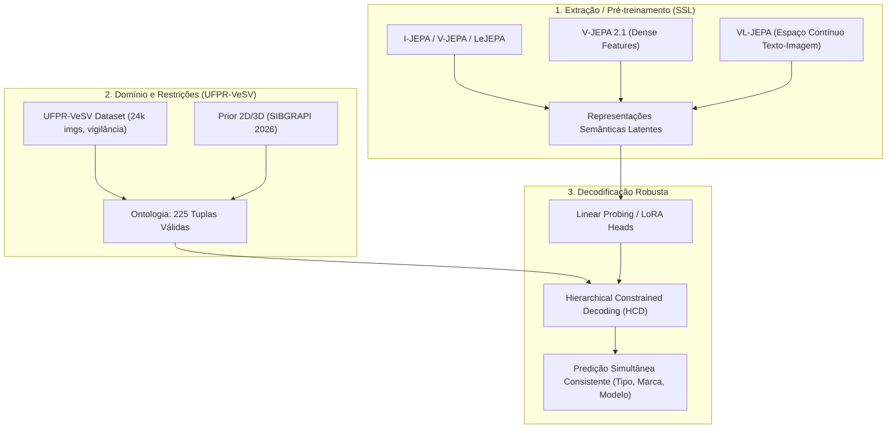

# Índice e Fichamento Técnico das Referências (`jepa-fgvc`)

Este documento serve como a **base de conhecimento primária e imediata** para qualquer consulta de IA sobre os artigos e relatórios contidos nesta pasta. Ele elimina a necessidade de reprocessar os PDFs binários, permitindo consultas instantâneas e navegação direta para os arquivos de texto extraídos.

---

## 1. Mapa Geral dos Artigos

| # | Arquivo PDF Original | Arquivo de Texto Extraído | Título / Tema Principal | Autores / Ano | Foco Central |
|---|----------------------|---------------------------|-------------------------|---------------|--------------|
| 1 | `Self-Supervised_Learning_from_Images_with_a_Joint-Embedding_Predictive_Architecture.pdf` | [`ijepa_extracted.txt`](file:///home/ppm24/experiments/jepa-fgvc/references/ijepa_extracted.txt) | **I-JEPA**: Self-Supervised Learning from Images with a Joint-Embedding Predictive Architecture | Assran et al. (Meta FAIR, CVPR 2023) | SSL em imagens sem reconstrução de pixels nem data augmentation manual; predição em espaço latente |
| 2 | `3520_V_JEPA_Latent_Video_Predi.pdf` | [`vjepa_extracted.txt`](file:///home/ppm24/experiments/jepa-fgvc/references/vjepa_extracted.txt) | **V-JEPA**: Latent Video Prediction for Visual Representation Learning | Bardes et al. (Meta FAIR, ICLR 2024) | Extensão de JEPA para vídeo; mascaramento espaço-temporal; representações sem fine-tuning |
| 3 | `v-jepa2.pdf` | [`vjepa2_extracted.txt`](file:///home/ppm24/experiments/jepa-fgvc/references/vjepa2_extracted.txt) | **V-JEPA 2**: Self-Supervised Video Models Enable Understanding, Prediction and Planning | Assran et al. (Meta FAIR, 2025) | Escalonamento em 1M h de vídeo; modelos de mundo condicionados por ação (V-JEPA 2-AC) |
| 4 | `v-jepa2.1.pdf` | [`vjepa2_1_extracted.txt`](file:///home/ppm24/experiments/jepa-fgvc/references/vjepa2_1_extracted.txt) | **V-JEPA 2.1**: Unlocking Dense Features in Video Self-Supervised Learning | Mur-Labadia et al. (Meta FAIR / Unizar, 2026) | Dense Predictive Loss e Deep Self-Supervision; preservação de detalhes espaciais finos |
| 5 | `ICLR-2026-vl-jepa-joint-embedding-predictive-architecture-for-vision-language-Paper-Conference.pdf` | [`vljepa_extracted.txt`](file:///home/ppm24/experiments/jepa-fgvc/references/vljepa_extracted.txt) | **VL-JEPA**: Joint-Embedding Predictive Architecture for Vision-Language | Chen et al. (Meta FAIR / HKUST, ICLR 2026) | VLM sem geração autoregressiva token-a-token; predição em espaço contínuo; selective decoding |
| 6 | `lejepa.pdf` | [`lejepa_extracted.txt`](file:///home/ppm24/experiments/jepa-fgvc/references/lejepa_extracted.txt) | **LeJEPA**: Provable and Scalable Self-Supervised Learning Without the Heuristics | Balestriero & LeCun (Meta FAIR / Brown / NYU, 2025/2026) | Teoria de JEPA; remoção de heurísticas (sem EMA, sem stop-grad); regularização SIGReg |
| 7 | `Toward_Unified_Fine-Grained_Vehicle_Classification.pdf` | [`unified_extracted.txt`](file:///home/ppm24/experiments/jepa-fgvc/references/unified_extracted.txt) | **Toward Unified FGVC & ALPR**: Dataset UFPR-VeSV | Lima, Laroca, Menotti et al. (UFPR / JBCS 2026) | Apresentação do dataset UFPR-VeSV (24.945 imagens, 16.297 veículos) com atributos (marca, modelo, tipo, cor) |
| 8 | `2026_SIBGRAPI_3D_FGVC_Alexandre-10.pdf` | [`sibgrapi_extracted.txt`](file:///home/ppm24/experiments/jepa-fgvc/references/sibgrapi_extracted.txt) | **Evaluating 2D and 3D-Aware Vision Foundation Models for Vehicle Attribute Recognition** | Delazeri, Lima, Menotti et al. (UFPR, SIBGRAPI 2026) | Benchmark de 14 Foundation Models (2D vs 3D) no UFPR-VeSV; DINOv3 lidera em marca/modelo; Depth Anything v2 em ângulos |
| 9 | `2026_IPASP_PR_Sept2026_Meta5_RenanAkira (1).pdf` | [`renan_extracted.txt`](file:///home/ppm24/experiments/jepa-fgvc/references/renan_extracted.txt) | **IPASP-PR Meta 5 Report**: Hierarchical Constrained Decoding (HCD) & LoRA | Renan Akira Escribano (UFPR / DInf, 2026) | Resolução do problema hierárquico no UFPR-VeSV; HCD (restrição a 225 tuplas); calibração ECE; LoRA |

---

## 2. Fichamento Técnico por Domínio

### PARTE A: O Ecossistema JEPA (Representações Visuais e Auto-Supervisão)

#### 1. I-JEPA (Assran et al., CVPR 2023)
* **Arquivo texto:** [`ijepa_extracted.txt`](file:///home/ppm24/experiments/jepa-fgvc/references/ijepa_extracted.txt)
* **Objetivo:** Treinar representações visuais altamente semânticas sem depender de aumentações artificiais pesadas (como crop extremo, color jitter) e sem reconstrução em nível de pixel (como MAE).
* **Arquitetura:**
  - **Context Encoder ($E_\theta$):** Processa apenas os patches visíveis de contexto de uma imagem.
  - **Target Encoder ($E_{\bar{\theta}}$):** Processa a imagem completa e extrai as representações dos blocos-alvo (atualizado via Exponential Moving Average - EMA dos pesos de $E_\theta$, com $\text{stop-gradient}$).
  - **Predictor ($P_\phi$):** Recebe as representações de contexto e tokens de máscara indicando as posições alvo, predizendo as representações dos blocos-alvo no espaço latente.
* **Estratégia de Mascaramento:**
  - Amostragem de blocos-alvo semanticamente grandes (escala entre 0.15 e 0.2 da imagem).
  - Bloco de contexto espacialmente disperso / amplo (escala 0.85 a 1.0) excluindo as regiões alvo.
* **Função de Perda:** Erro médio $L_1$ ou $L_2$ no espaço latente normalizado entre a representação predita e a do target encoder:
  $$\mathcal{L} = \frac{1}{M} \sum_{i=1}^M \mathcal{D}(P_\phi(s_x, z_i), s_{y_i})$$

#### 2. V-JEPA (Bardes et al., ICLR 2024)
* **Arquivo texto:** [`vjepa_extracted.txt`](file:///home/ppm24/experiments/jepa-fgvc/references/vjepa_extracted.txt)
* **Objetivo:** Predição latente aplicada a fluxos temporais de vídeo sem reconstruir frames de pixels.
* **Arquitetura & Mascaramento:**
  - Tubelet masking espaço-temporal (blocos 3D $2 \times 16 \times 16$).
  - Máscaras volumétricas (short-range e long-range temporal masking).
  - Context encoder processa apenas tubelets não mascarados; target encoder (EMA) gera representações completas; cross-attention predictor mapeia o contexto para prever os blocos latentes mascarados.
* **Destaques:** Frozen feature evaluation supera modelos baseados em pixels (VideoMAE) em tarefas dependentes de movimento (Something-Something-v2: 71.2%) e aparência (Kinetics-400: 82.1%).

#### 3. V-JEPA 2 (Assran et al., arXiv 2025)
* **Arquivo texto:** [`vjepa2_extracted.txt`](file:///home/ppm24/experiments/jepa-fgvc/references/vjepa2_extracted.txt)
* **Objetivo:** Escalar para >1 milhão de horas de vídeo na web e demonstrar capacidades unificadas de compreensão de movimento, previsão e planejamento robótico.
* **Componentes:**
  - **V-JEPA 2 base:** Pré-treinamento maciço em vídeo/imagem (ViT-g/14, ViT-G/14).
  - **Alinhamento com Linguagem:** Conexão com LLM (Llama) para Video-QA de ponta.
  - **V-JEPA 2-AC (Action-Conditioned):** Modelo de mundo pós-treinado com trajetórias robóticas (dataset DROID, <62 horas). Recebe estado atual + ação pretendida e prediz o embedding latente futuro para planejamento com *cross-entropy method* (CEM).

#### 4. V-JEPA 2.1 (Mur-Labadia et al., arXiv 2026)
* **Arquivo texto:** [`vjepa2_1_extracted.txt`](file:///home/ppm24/experiments/jepa-fgvc/references/vjepa2_1_extracted.txt)
* **Objetivo:** Resolver a carência de recursos densos/espacialmente detalhados dos JEPAs padrão (que tendem a focar excessivamente na semântica global).
* **Inovações Principais:**
  1. **Dense Predictive Loss:** Todos os tokens (tanto os visíveis quanto os mascarados) contribuem para a perda, forçando coerência espacial pixel-a-patch.
  2. **Deep Self-Supervision:** Aplicação hierárquica do objetivo JEPA em camadas intermediárias do encoder.
  3. **Multi-Modal Tokenizers:** Tratamento uniforme e simultâneo de imagens estáticas e vídeos.
* **Impacto:** Ganhos substanciais em rastreamento de objetos (DAVIS), segmentação semântica (ADE20K), predição de profundidade monocular (NYUv2) e controle motor fino.

#### 5. VL-JEPA (Chen et al., ICLR 2026)
* **Arquivo texto:** [`vljepa_extracted.txt`](file:///home/ppm24/experiments/jepa-fgvc/references/vljepa_extracted.txt)
* **Objetivo:** Eliminar a geração autorregressiva token-a-token cara dos VLMs tradicionais, operando em espaço contínuo.
* **Mecanismo:**
  - $x$-encoder (visão) codifica entrada $X^V \to S^V$.
  - $y$-encoder (texto alvo) codifica resposta $Y \to S^Y$.
  - Predictor mapeia $(S^V, X^Q) \to \hat{S}^Y$, onde $X^Q$ é o prompt de consulta.
  - **Selective Decoding:** Decodificador de texto leve invocado sob demanda apenas quando texto explícito for necessário (~2.85x mais rápido).
  - Suporta nativamente classificação open-vocabulary e busca cross-modal via similaridade no espaço latente.

#### 6. LeJEPA (Balestriero & LeCun, 2025/2026)
* **Arquivo texto:** [`lejepa_extracted.txt`](file:///home/ppm24/experiments/jepa-fgvc/references/lejepa_extracted.txt)
* **Objetivo:** Estabelecer a teoria unificada de JEPAs e remover todas as heurísticas práticas (sem EMA/teacher-student, sem stop-gradient, sem schedulers complexos).
* **Teorema Fundamental:** A distribuição ótima das representações de um JEPA para minimizar o risco downstream sob perda afim é uma **Gaussiana Isotrópica**.
* **SIGReg (Sketched Isotropic Gaussian Regularization):**
  - Regularizador que projeta os embeddings em direções aleatórias 1D e impõe normalidade e decorrelação.
  - Complexidade linear no tamanho do batch e dimensão.
  - Implementável em ~50 linhas de PyTorch; permite treinar encoders sem colapso usando otimização direta com gradiente end-to-end.

---

### PARTE B: Classificação Fina de Veículos (FGVC) & Dataset UFPR-VeSV

#### 7. Toward Unified FGVC and ALPR (Lima, Laroca, Menotti et al., JBCS 2026)
* **Arquivo texto:** [`unified_extracted.txt`](file:///home/ppm24/experiments/jepa-fgvc/references/unified_extracted.txt)
* **Dataset UFPR-VeSV:**
  - **24.945 imagens** de **16.297 veículos únicos** capturadas pelas câmeras de vigilância da Polícia Militar do Paraná (PMPR).
  - Condições reais severas: imagens diurnas, noturnas em infravermelho (IR), oclusões parciais, variações de ângulo extremo.
  - Anotações completas: **13 cores**, **26 marcas**, **136 modelos** e **14 tipos**.
  - Anotações adicionais: caixas delimitadoras e caracteres das placas (ALPR).
* **Desafios Destacados:** Plataformas compartilhadas entre modelos similares, veículos multicoloridos e degradação em câmeras IR monocromáticas.

#### 8. Evaluating 2D and 3D Foundation Models for FGVC (Delazeri et al., SIBGRAPI 2026)
* **Arquivo texto:** [`sibgrapi_extracted.txt`](file:///home/ppm24/experiments/jepa-fgvc/references/sibgrapi_extracted.txt)
* **Benchmark:** 14 modelos fundacionais avaliados no UFPR-VeSV sob linear probing congelado, poucas amostras (few-shot) e teste fora de distribuição (OOD).
* **Resultados Chave:**
  - Modelos 2D SSL (especialmente **DINOv3**) superam os modelos 3D em atributos finos (marca e modelo), passando de 93% de Macro-Acurácia.
  - Modelos 3D (ex.: **Depth Anything v2**) mostram maior robustez e invariância a variações extremas de ângulo de visão na predição de **tipo de veículo**.
  - Conclusão: Modelos híbridos ou com priors estruturais/geométricos são promissores.

#### 9. Relatório IPASP-PR Meta 5: HCD e LoRA (Renan Akira Escribano, 2026)
* **Arquivo texto:** [`renan_extracted.txt`](file:///home/ppm24/experiments/jepa-fgvc/references/renan_extracted.txt)
* **O Problema da Hierarquia:**
  - Uma predição em vigilância policial só é útil para busca quando a tupla inteira `(Tipo, Marca, Modelo)` está **simultaneamente correta**.
  - Cabeças independentes geram combinações impossíveis (ex.: Sedã Toyota Civic).
* **Soluções Consolidadas:**
  1. **Hierarchical Constrained Decoding (HCD):** Decodificação restrita às **225 tuplas válidas** observadas na ontologia do projeto. Ganho de **+2.86 a +10.10 p.p.** na acurácia simultânea, sem treinamento adicional (*training-free*).
  2. **Joint-Class Prompting:** Substituição de três prompts marginais de VLMs por um único classificador conjunto de 225 classes.
  3. **Visual LoRA:** Ajuste em backbones visuais (PE-Core-bigG alcançou 94.78% e SigLIP2-gopt alcançou 93.93%).
  4. **Calibração:** Temperature scaling levou o Expected Calibration Error (ECE) para 0.85%–1.66%.

---

## 3. Conexão Direta com o Projeto `jepa-fgvc`

O repositório `jepa-fgvc` investiga a aplicação dos princípios de **Joint-Embedding Predictive Architectures** no problema de **Fine-Grained Vehicle Classification**:

### Pontos de Atenção para Experimentos:
1. **Representação Fina vs Global:** JEPAs padrão (I-JEPA) focam em semântica global de alto nível. Para diferenciar modelos de veículos com diferenças sutis (faróis, grades, para-choques), abordagens com perdas densas como no **V-JEPA 2.1** ou regularização **LeJEPA (SIGReg)** são fundamentais.
2. **Avaliação Congelada (*Frozen Probing*):** Seguir o protocolo padrão do SIBGRAPI 2026 e do IPASP-PR, avaliando tanto a acurácia individual de cada atributo quanto a **acurácia simultânea** calibrada via HCD.
3. **Restrição Ontológica:** Sempre integrar HCD na etapa de inferência/decodificação para garantir consistência física entre tipo, marca e modelo.

---

## 4. Instruções de Consulta Rápida para Agentes / IAs

- Quando precisar de uma **visão conceitual** ou de **comparações de desempenho**: leia este arquivo [`INDEX.md`](file:///home/ppm24/experiments/jepa-fgvc/references/INDEX.md).
- Quando precisar de **hiperparâmetros, fórmulas matemáticas ou detalhes de implementação**: faça `grep_search` ou `view_file` diretamente no arquivo de texto correspondente ([`ijepa_extracted.txt`](file:///home/ppm24/experiments/jepa-fgvc/references/ijepa_extracted.txt), [`vjepa_extracted.txt`](file:///home/ppm24/experiments/jepa-fgvc/references/vjepa_extracted.txt), [`lejepa_extracted.txt`](file:///home/ppm24/experiments/jepa-fgvc/references/lejepa_extracted.txt), [`vljepa_extracted.txt`](file:///home/ppm24/experiments/jepa-fgvc/references/vljepa_extracted.txt), [`renan_extracted.txt`](file:///home/ppm24/experiments/jepa-fgvc/references/renan_extracted.txt), etc.).
- **NÃO é necessário processar os arquivos `.pdf` novamente.**
